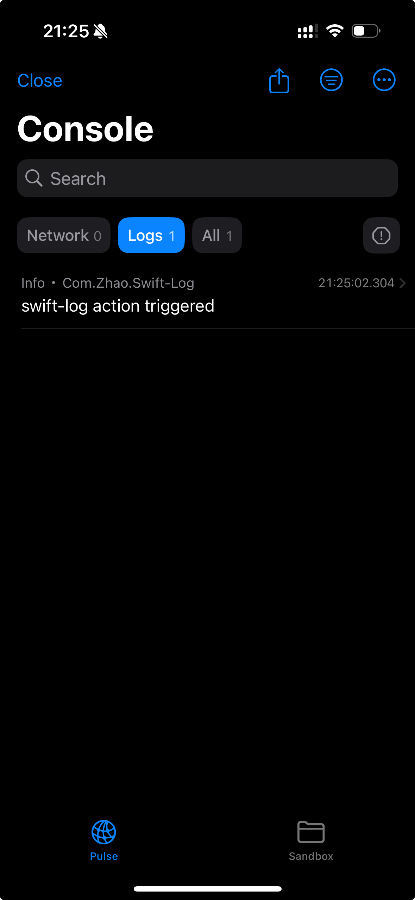

# DebugTools

DebugTools是一个功能丰富的iOS调试工具库，为开发者提供了便捷的调试功能，包括网络请求监控、沙盒文件浏览、多日志系统支持等，帮助开发者在开发过程中快速定位和解决问题。



## 功能特性

### DebugTools 模块

- **浮动调试按钮**：可拖拽的悬浮按钮，支持智能吸边，点击后显示主调试界面
- **摇一摇功能**：通过摇晃设备快速显示/隐藏调试工具
- **网络日志监控**：集成Pulse，提供详细的网络请求/响应查看功能
- **沙盒文件浏览器**：浏览应用沙盒中的文件和文件夹
- **文件预览**：支持多种文件格式的预览，包括：
  - 图片、视频、PDF等（通过QuickLook）
  - JSON文件（自动格式化）
  - XML/Plist文件
  - HTML文件（通过WebView）
  - 文本文件
  - 二进制文件（十六进制预览）
- **文件信息查看**：显示文件的详细信息（大小、创建时间、修改时间等）
- **文件分享**：支持将文件通过系统分享功能导出

### MultiLogHandler 模块
- **多日志处理器**：支持同时将日志发送到多个日志处理器

## 系统要求

- iOS 15.0+
- Swift 5.7+
- Xcode 14.0+

## 安装

### Swift Package Manager

在Xcode中，选择File > Add Package Dependencies...，然后输入仓库URL：

```
https://github.com/zhaozzq/DebugTools.git
```

或者在你的Package.swift文件中添加依赖：

```swift
dependencies: [
    .package(url: "https://github.com/zhaozzq/DebugTools.git", from: "0.0.1")
]
```

然后在目标中添加需要的模块：

```swift
targets: [
    .target(
        name: "YourTarget",
        dependencies: [
            .product(name: "DebugTools", package: "DebugTools"),
            .product(name: "MultiLogHandler", package: "DebugTools")
        ]
    )
]
```

## 使用方法

### 基本用法

1. 导入DebugTools模块
2. 在AppDelegate或SceneDelegate中初始化并设置调试工具

```swift
import UIKit
import DebugTools

class AppDelegate: UIResponder, UIApplicationDelegate {
    
    func application(_ application: UIApplication, didFinishLaunchingWithOptions launchOptions: [UIApplication.LaunchOptionsKey: Any]?) -> Bool {
        // 初始化调试工具
        DebugTools.shared.setup()
        return true
    }
}
```

### 手动控制调试工具

```swift
// 显示调试工具
DebugTools.shared.show()

// 隐藏调试工具
DebugTools.shared.hide()
```

### MultiLogHandler 使用

```swift
import Logging
import MultiLogHandler
import OSLogHandler // 如果你想使用OSLogHandler

// 创建多个日志处理器
let consoleHandler = StreamLogHandler.standardOutput(label: "com.example.app")
let osLogHandler = OSLogHandler(subsystem: "com.example.app", category: "default")

// 创建多日志处理器
let multiHandler = MultiLogHandler(
    label: "com.example.app", 
    handlers: [consoleHandler, osLogHandler]
)

// 创建Logger并使用
let logger = Logger(label: "com.example.app", factory: { _ in multiHandler })
logger.info("This message will be logged to both console and OSLog")
```

## 功能详情

### 1. 浮动调试按钮

- **位置调整**：拖动按钮到任意位置，释放后会智能吸附到最近的屏幕边缘
- **点击行为**：点击按钮会显示主调试界面，包含网络日志和沙盒文件浏览器

### 2. 网络日志监控

DebugTools集成了Pulse库，提供强大的网络监控功能：
- 查看所有网络请求和响应
- 按时间、域名、路径等筛选请求
- 查看详细的请求和响应头、正文
- 支持搜索和导出网络日志

### 3. 沙盒文件浏览器

- **文件导航**：浏览应用沙盒中的所有文件和文件夹
- **文件操作**：查看文件内容、信息，分享文件
- **文件预览**：根据不同文件类型提供最佳的预览方式

### 4. 文件预览支持

- **图片**：支持JPG、PNG、GIF、HEIC等常见图片格式
- **视频**：支持MP4、MOV、AVI等常见视频格式
- **PDF**：支持PDF文件预览
- **文本文件**：支持普通文本预览
- **JSON/XML**：自动格式化并高亮显示
- **HTML**：通过WebView渲染HTML内容
- **二进制文件**：以十六进制形式显示前1024字节

## 注意事项

- 调试工具默认只在DEBUG模式下启用
- 请勿在生产环境中包含调试工具的功能
- 沙盒文件浏览器提供了对应用文件系统的完整访问权限，请确保不会修改重要文件

## 依赖

- [Pulse](https://github.com/kean/Pulse) - 网络日志和监控
- [swift-log](https://github.com/apple/swift-log) - 日志系统

## 许可证

MIT License

## 贡献

欢迎提交Issue和Pull Request来改进这个库。

## 作者

zhaozq

## 版本历史

### 0.0.1
- 初始版本发布
- 实现浮动调试按钮
- 集成Pulse网络日志监控
- 实现沙盒文件浏览器和文件预览
- 发布MultiLogHandler模块